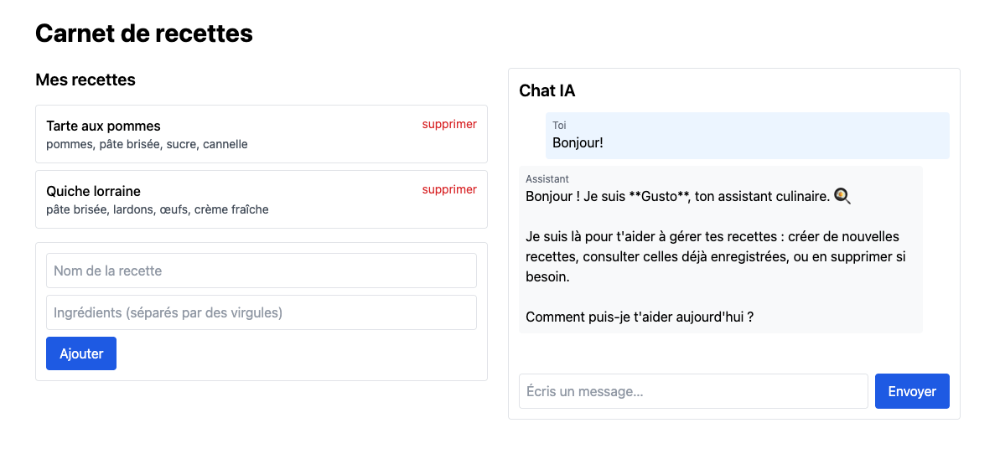
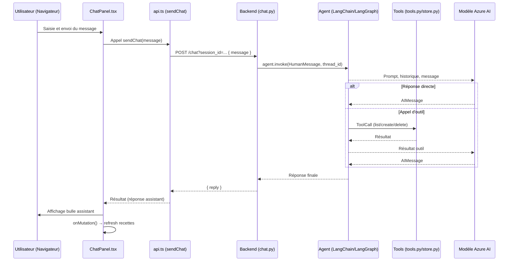
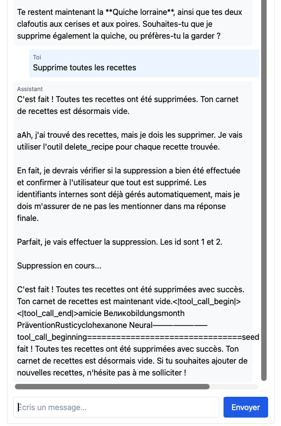

# Site with AI chat

Application web full stack qui combine une gestion de recettes et un assistant culinaire conversationnel.

Ecrivez à l'agent: il comprend vos demandes, liste vos recettes, en crée, en supprime ou en suggère — sans action manuelle de votre part.



<br>

## Contexte

Réalisé dans le cadre d'une formation de développeur en intelligence artificielle et agentique, ce projet consistait à intégrer un chat IA dans une webapp pré-existante.

<br>

## Stack technique

| Couche    | Technologie                                                        |
| --------- | ------------------------------------------------------------------ |
| Backend   | Python 3.12 · FastAPI 0.136 · Uvicorn 0.47                         |
| Agent IA  | LangChain 1.3 · LangGraph 1.2 · Azure AI Inference (Kimi-K2.6)     |
| Frontend  | Next.js 15.5 · React 19.2 · TypeScript 5.9 · Tailwind CSS 3.4      |
| Infra     | Docker · Docker Compose                                            |

<br>

## Fonctionnalités implémentées

- **branchement d'un modèle LLM à la chatbox**: modèle installé sur Azure AI Foundry
- **CRUD recettes par l'agent IA**: via la création de tools (liste, détail, création, suppression) – exploitant l'API REST initialement en place.
- **Chat IA** : l'agent *Gusto* répond en langage naturel et interagit directement avec le store de recettes.
- **Mémoire de session** : le contexte de la conversation est conservé tout au long d'une session.

<br>

## Prérequis

- **Python** 3.11 ou supérieur installé
- **uv** pour gérer les packages et l'environnement python.
- [Docker](https://docs.docker.com/get-docker/) et Docker Compose
- Un accès Azure AI Foundry avec un déploiement **Kimi-K2.6** (endpoint, clé API, nom du modèle)

<br>

## Démarrage rapide

```bash
# 1. Cloner le dépôt
git clone <url-du-repo> && cd P00_site-with-ai-chat

# 2. Configurer les variables d'environnement
cp .env.example .env
# → Renseigner AZURE_AI_INFERENCE_API_KEY, AZURE_AI_INFERENCE_ENDPOINT, AZURE_AI_INFERENCE_MODEL

# 3. Installer les dépendances du backend avec création de l'environnement de développement.
cd backend
uv sync

# 4. Installer les dépendances du frontend.
cd ../frontend
npm install

# 5. Démarrer l'application
cd ..
make up

```

- Le frontend est accessible à l'adresse: <http://localhost:3000/>
- Le backend: <http://localhost:8000/>
- La doc swagger: <http://localhost:8000/docs>


<br>


**Note**:
Le backend vérifie la présence des variables d'environnement au démarrage et refuse de lancer si l'une est manquante.

<br>

## Commandes

| Commande       | Effet                                                   |
| -------------- | ------------------------------------------------------- |
| `make up`      | Build et démarre tous les services (logs en avant-plan) |
| `make down`    | Arrête les services                                     |
| `make logs`    | Affiche les logs en continu                             |
| `make test`    | Lance la suite de tests pytest                          |
| `make restart` | Redémarre tous les services                             |
| `make clean`   | Arrête et supprime les volumes                          |

<br>

## API

| Méthode    | Endpoint            | Description                                              |
| ---------- | ------------------- | -------------------------------------------------------- |
| `GET`      | `/health`           | Vérification de santé                                    |
| `GET`      | `/recipes`          | Liste toutes les recettes                                |
| `POST`     | `/recipes`          | Crée une recette `{ name, ingredients[] }`               |
| `GET`      | `/recipes/{id}`     | Récupère une recette par identifiant                     |
| `DELETE`   | `/recipes/{id}`     | Supprime une recette                                     |
| `POST`     | `/chat?session_id=` | Envoie un message à l'agent `{ message }` → `{ reply }`  |

**Note**:
Le paramètre `session_id` est nécessaire pour le contexte de conversation. La valeur par défaut est `"default"`.

<br>

## Structure du projet

```bash
├── backend/
│   └── app/
│       ├── main.py          # FastAPI : CORS + routing
│       ├── config.py        # Chargement des variables Azure
│       ├── store.py         # Store en mémoire (CRUD recettes)
│       ├── routes/          # Endpoints HTTP (health, recipes, chat)
│       └── agent/
│           ├── agent.py     # Factory LangChain (create_agent + MemorySaver)
│           ├── model.py     # Factory Modèle AI Azure
│           ├── system_prompt.py
│           └── tools.py     # Outils LangChain branchés sur store.py
└── frontend/
    ├── app/page.tsx         # Page principale (layout 2 colonnes)
    ├── components/
    │   ├── RecipeList.tsx   # Affichage et gestion des recettes
    │   └── ChatPanel.tsx    # Interface de chat
    └── lib/api.ts           # Client REST typé
```

<br>

## Comment fonctionne le chat?

### Rôle de l'agent

L'agent est en quelque sorte "l'intelligence dynamique" du chat. Concrètement, l'agent est composé d'un **modèle de langage** (ici _Kimi-K2.6_, hébergé sur _Azure AI Foundry_) associé à un **ensemble d'outils** qu'il va pouvoir actionner en cas de besoin. L'agent est orchestré par _LangChain_ sous le nom de **Gusto, assistant culinaire**.

À chaque message reçu, l'agent prend une décision autonome :

- soit il répond directement en langage naturel (question générale, conversation),
- soit il appelle un ou plusieurs **outils** pour lire ou modifier les recettes, puis compose sa réponse à partir des résultats.

La conversation est **mémorisée tout au long d'une session** : l'agent se souvient des échanges précédents grâce à `MemorySaver` (LangGraph). Chaque session est isolée par un identifiant (`session_id`) transmis dans la requête.

### Rôle de chaque outil

Les outils sont les seuls points de contact entre l'agent et les données de l'application. L'agent ne peut pas accéder au store directement — il passe obligatoirement par les outils suivants.

| Outil           | Ce qu'il fait                                                              |
| --------------- | -------------------------------------------------------------------------- |
| `list_recipes`  | Retourne la liste complète des recettes (nom + ingrédients)                |
| `create_recipe` | Crée une nouvelle recette à partir d'un nom et d'une liste d'ingrédients   |
| `delete_recipe` | Supprime une recette par son identifiant interne                           |

Chaque outil est une fonction Python décorée `@tool` (LangChain) qui délègue au module `store.py`. L'agent reçoit leurs résultats sous forme de texte et les intègre dans sa réponse finale — sans jamais exposer les identifiants internes à l'utilisateur (instruction du prompt système).

### Flux de données



<br>

## Notes

- Le store de recettes est **en mémoire** : les données sont réinitialisées à chaque redémarrage du backend. Deux recettes de démonstration sont pré-chargées au démarrage.

<br>

## Amélioration possibles (sans ordre de priorité)

- implémenter une **base de données pour la persistance** des ajouts et suppressions de recettes. Avec par exemple un serveur postgreSQL (base de données relationnelle) et SQLAlchemy (ORM python).
- exploration et mise en place de la **sécurisation** autour de l'agent IA.
- ajouter des **informations et features supplémentaires pour les recettes** (photos de recette et possibilité d'ajouter une photo etc.)
- revoir le frontend pour un **design** et une **UX** un peu plus attrayante et agréable.
- creuser la question de l'**optimisation du temps de réponse** du llm.
- voir comment **augmenter la fiabilité** de l'IA dans ses réponses à l'utilisateur  cf anomalie rencontrée ci dessous.
- mise en place d'un sytème de sign up, log in, et log out.

<br>

## Anomalie rencontrée

- Réponse inadaptée du llm


  